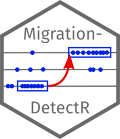

[](https://www.dlr.de/eoc/en/desktopdefault.aspx/tabid-5413/10560_read-21914/) 

UKIS - MigrationDetectR 
==============

 
<!-- badges: start -->
[](https://lifecycle.r-lib.org/articles/stages.html#stable)
<!--[](https://CRAN.R-project.org/package=MigrationDetectR)-->
<!-- badges: end -->

Implementation of Migration detection algorithm, published by Chi et al. (2020) in [A general approach to detecting migration events in digital trace data](https://doi.org/10.1371/journal.pone.0239408)

## Installation

The package can be installed as follows:

``` r
install.packages("MigrationDetectR")
```

## Example


### Input data

First, make sure your data into the format required by the package: Two aligned vectors for each individual, one with locations and one with timestamps.


``` r
library(MigrationDetectR)
# Load an example trace
trace <- example_trace

# a vector of `POSIXct` timestamps
timestamps = example_trace$timestamp
tail(timestamps)

# a vector of `character` locations
locations = example_trace$location
tail(locations)
```

The basic usage consists of two steps:

### Identifying segments of continuous residence

First, use the `detect_segments` function to identify segments of continuous residence.

``` r
# Detect segments
segments <-
  detect_segments(
      locs = locations,
      times = timestamps,
      param_min_days = 3,
      param_prop_days = 0.06,
      param_window_size_days = 7)
 nrow(segments) # check the number of detected segments

```

### Identifying segments of continuous residence

Second, use the `identify_migrations` function on the segments to detect migrations.
To optionally determine the best split time, pass the original locations and timestamps vectors. Note that this increases the computational load substantially.

``` r
 migrations <-
 identify_migrations(
  segs = segments$segments,
  locs = segments$locs,
  min_res_length = 90,
  occurrence_locs = trace$location,
  occurrence_times = trace$timestamp
  )
  nrow(migrations) # check the number of identified migrations
  head(migrations) # check the detected migrations
```

## Multiple users

The functions process one user at a time. Datasets with multiple users need to be split.
For very large datasets, we recommend to apply the function with some degree of [parallelization](https://bookdown.org/rdpeng/rprogdatascience/parallel-computation.html).

Alternatively, consider the [Python implementation](https://github.com/g-chi/migration_detector).


## Contributors
The UKIS team creates and adapts libraries which simplify the usage of satellite data:

* Mast, Johannes

German Aerospace Center (DLR)

## Licenses
This software is licensed under the [Apache 2.0 License](https://github.com/dlr-eoc/ukis-migrationdetectr/blob/main/LICENSE.txt).

Copyright (c) 2023 German Aerospace Center (DLR) * German Remote Sensing Data Center * Department: Geo-Risks and Civil Security

## Changelog
See [NEWS](https://github.com/dlr-eoc/ukis-migrationdetectr/blob/main/NEWS.md).

## Contributing
The UKIS team welcomes contributions from the community.
For more detailed information, see our guide on [contributing](https://github.com/dlr-eoc/ukis-pysat/blob/master/CONTRIBUTING.md) if you're interested in getting involved.

## What is UKIS?
The DLR project Environmental and Crisis Information System (the German abbreviation is UKIS, standing for [Umwelt- und Kriseninformationssysteme](https://www.dlr.de/eoc/en/desktopdefault.aspx/tabid-5413/10560_read-21914/) aims at harmonizing the development of information systems at the German Remote Sensing Data Center (DFD) and setting up a framework of modularized and generalized software components.

UKIS is intended to ease and standardize the process of setting up specific information systems and thus bridging the gap from EO product generation and information fusion to the delivery of products and information to end users.

Furthermore, the intention is to save and broaden know-how that was and is invested and earned in the development of information systems and components in several ongoing and future DFD projects.
